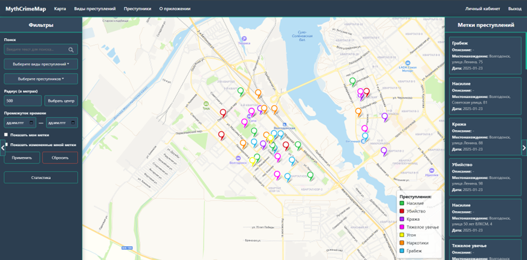
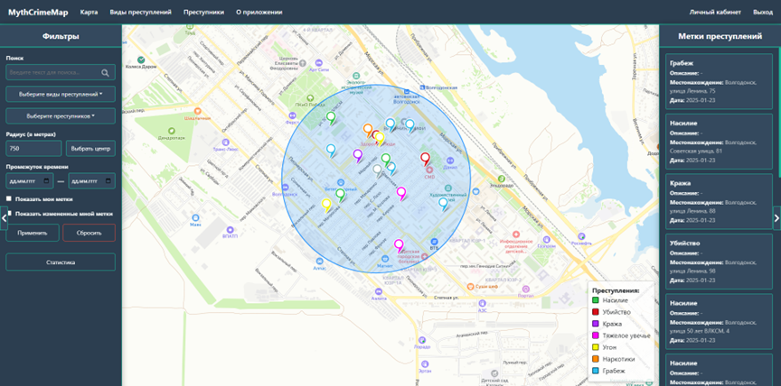
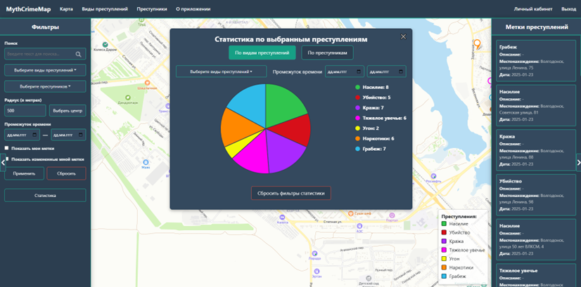
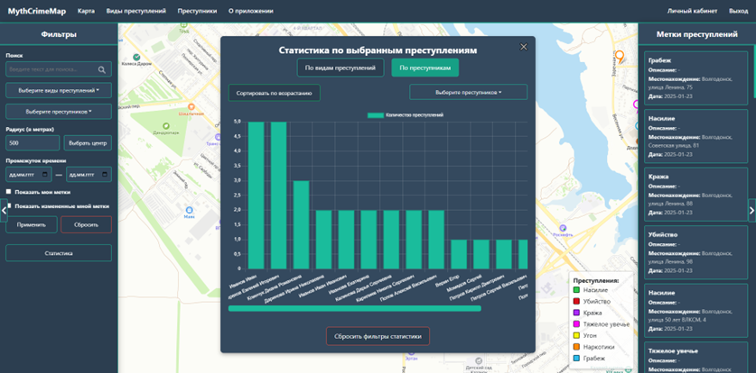
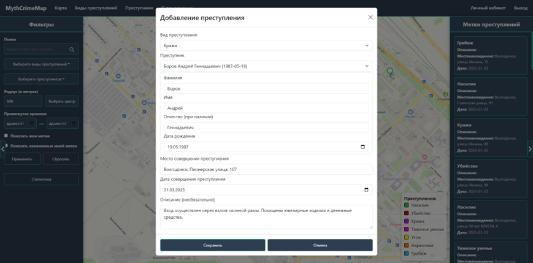
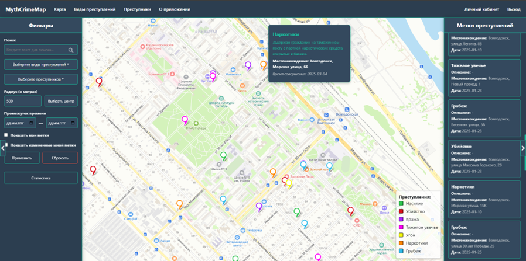
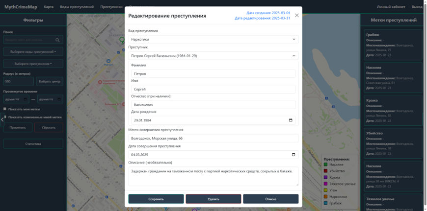
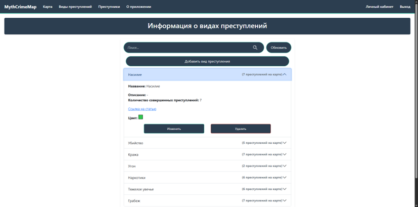
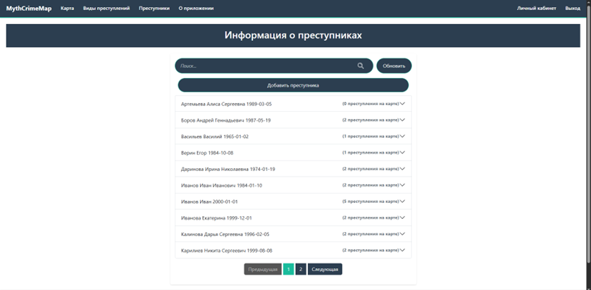
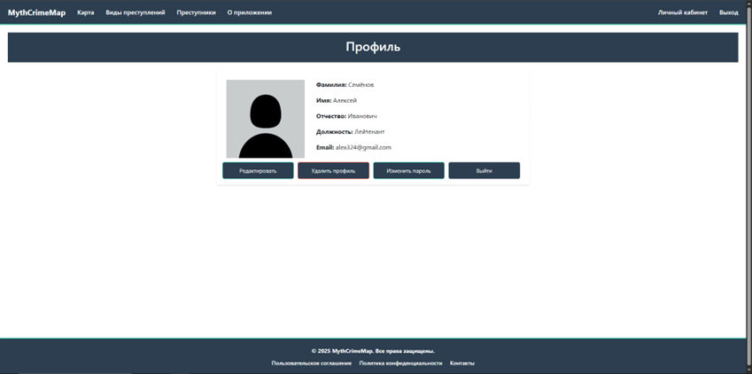

# MythCrimeMapping

## Содержание
- [Описание](#описание)
- [Технологии](#технологии)
- [Требования](#требования)
- [Как запустить](#как-запустить)
- [Конфигурация](#конфигурация)
- [Документация API](#документация-api)
- [Релокация](#релокация)

---
 
## Описание
Веб-приложение предоставляет возможность отображения и управления информацией о преступлениях на карте. Приложение предназначено для удобного анализа и управления данными о преступлениях, предоставляя мощный инструмент для мониторинга и принятия решений.

Интерактивная карта преступлений отображает зарегистрированные преступления на карте города, предоставляя наглядную информацию о криминальной ситуации. Справа эти данные представлены в виде списка:

Слева представлены фильтры для карты. Пользователи могут фильтровать преступления, выбирая какого вида преступления отображать, период за которое оно произошло, центр и радиус круга на карте для отображения в конкретной зоны и отдельных преступников:

По этим данным в специальном окне можно посмотреть статистику по видам преступлений:

А также статистику по преступникам:

Можно создавать преступления, нажав на место его совершения. Откроется форма ввода информации. Здесь надо выбрать преступника из имеющихся или создать нового, выбрать вид преступления, написать дату совершения и описание преступления, место совершения берется автоматически из координат, но при необходимости его можно скорректировать. После сохранения на карте в этом месте появится точка:

При наведении на маркер показывается основная информация:

Можно редактировать информацию преступления, нажав на его маркер. Откроется форма ввода информации аналогичной при его создании, но с заполненными полями для изменения. Или же можно удалить преступление:

На странице видов преступлений можно помапулировать и просматривать информацию о каждом виде преступлении в виде списка:

На странице преступников можно помапулировать и просматривать информацию о каждом преступнике в виде списка:

В личном кабинете пользователь может редактировать свои данные, изменить пароль, удалить профиль или выйти с него:

Авторизованные пользователи имеют доступ для манипуляции с преступлениями, их видами и преступниками, а неавторизованные могут только просматривать информацию.

---

## Технологии
- ReactJS — для клиента
- .NET 9 / ASP.NET Core Web API — для сервера
- Swagger / OpenAPI — генерация Swagger UI для документации API
- Entity Framework Core — ORM для взаимодействия с базой данных
- PostgreSQL — БД для хранения данных
- Docker / Docker Compose — развертывание проекта в контейнере
- Redis — в качестве распределенного кеша
- NGINX — в качестве балансировщика нагрузки для поднятия нескольких API
- Yandex Maps API — для отображение элементов на карте, взятии координат и превращения их в адреса

---

## Требования
Для запуска с помощью Docker Compose понадобится только Docker Desktop для Windows/Mac или Docker Engine + Docker Compose для Unix.

---

## Как запустить

### Как запустить с помощью Docker Compose
1. Рекомендуется. Используя образы с Docker Hub с балансировщиком нагрузки для поддержки нескольких API — перейдите в каталог репозитория и введите команду:

`docker compose -f .\docker-compose-with-load-images.yml up --scale api=<number_api>`

<number_api> — количества запускаемых API

2. Используя локальные файлы Docker — перейдите в каталог репозитория и напишите команду:

`docker-compose up`

После запуска веб-клиент будет доступен по адресу `http://localhost:80`, по адресу `http://localhost:8080/swagger` вы можете протестировать API.

Для удаления контейнеров напишите команду:

`docker-compose down`

---

## Конфигурация
Все переменные окружения и конфигурация определены в docker-compose

| Переменныя окружения | Описание |
| --- | --- |
| ALLOWED_ORIGINS | Разрешенные адреса для обращения к API |
| CONNECTION_STRING | Строка подключения к PostgreSQL |
| REDIS_HOST | Адрес к Redis |

Файле crimemapdb_dump.sql — конфигурация для инициализации базы данных и примеры начальных данных. Позже планируется реализовать миграции.

Файл nginx-loadbalancer.conf — конфигурация балансировщика нагрузки.

---

## Документация API
Подробно об отправляемых и получаемых данных посмотреть в swagger.

### Для управления преступлениями:
Получение списка преступления с фильтрацией:
> GET /api/crime-marks

Получения информации отдельного преступления:
> GET /api/crime-marks/{id}

Создание нового преступления:
> POST /api/crime-marks

Изменение преступления:
> PATCH /api/crime-marks

Удаление преступления:
> DELETE /api/crime-marks/{id}

### Для управления видами преступлений:
Получение всего списка названий видов преступлений:
> GET /api/crime-types/titles

Получение списка видов преступлений с фильтрацией и пагинацией:
> GET /api/crime-types

Получение информации об одном виде преступлений:
> GET /api/crime-types/{id}

Создание нового вида преступлений:
> POST /api/crime-types

Обновление вида преступлений:
> PATCH /api/crime-types

Удаление вида преступлений:
> DELETE /api/crime-types/{id}

### Для управления преступниками:
Получение всего списка преступников:
> GET /api/wanted-persons/basic

Получение списка преступников с фильтрацией и пагинацией:
> GET /api/wanted-persons

Получение информации об одном преступнике:
> GET /api/wanted-persons/{id}

Создание нового преступника:
> POST /api/wanted-persons

Обновление преступника:
> PATCH /api/wanted-persons

Удаление преступника:
> DELETE /api/wanted-persons/{id}

### Для аутентификации: 
Регистрация:
> POST /api/auth/signup

Вход:
> POST/api/auth/login

Отправка кода на email для подтверждения профиля:
> POST /api/auth/code

Смена пароля:
> POST /api/auth/changepassword

### Для управления пользователями:
Получение информации о пользователе:
> GET /api/users/{id}

Обновление информации о пользователе:
> PATCH /api/users/{id}

Удаление информации о пользователе:
> DELETE /api/users/{id}

### Для проверки состояния сервиса:
> GET /api/health

---

## Релокация

13 февраля 2025 года репозиторий был перенесён с [Github: Jolo1Reper/MiphiCrimeMapping](https://github.com/Jolo1Reper/MiphiCrimeMapping). Вся история изменений, произошедших до этого момента, хранится там.

---
